# Machine Learning For Absolute Beginners: A Plain English Introduction

[minicourse](#^minicourse)

## 2 WHAT IS MACHINE LEARNING?

A key characteristic of machine learning is the concept of _self-learning_. This
refers to the application of statistical modeling to detect patterns and improve
performance based on data and empirical information; _all without direct
programming commands_.

By decoding complex patterns in the input data, the model uses machine learning to find connections without human help.

Another distinct feature of machine learning is the ability to _improve predictions_ based on experience.
- Spam detection system is lured into producing a false-positive based on previous input data.
- Traditional programming is highly susceptible to this problem because the model is rigidly defined according to pre-set rules.

Machine learning, on the other hand, emphasizes _exposure to data as a way to refine_ the model, adjust weak assumptions, and respond appropriately to unique data points

### Training & Test Data

> _#training_data_ the initial reserve of data used to develop the model.

After you have developed a model based on patterns extracted from the training data and you are satisfied with the accuracy of its predictions, you can test the model on the remaining data, known as the _test data_.

### The Anatomy of Machine Learning

Machine learning, data mining, artificial intelligence, and computer programming all fall under the umbrella of computer science,

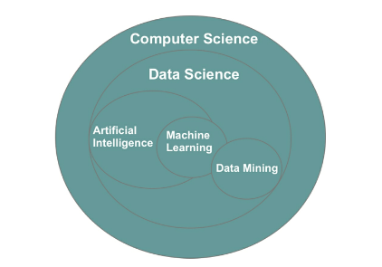
- Figure 4: Visual representation of the relationship between data-related fields

| Technique              | Input known | Output known | Methodology                                                                                        |     |
| ---------------------- | ----------- | ------------ | -------------------------------------------------------------------------------------------------- | --- |
| Data Mining            | ✅           |              | Analyzes inputs to generate an unknown output                                                      |     |
| Supervised Learning    | ✅           | ✅            | Analyzes combination of known inputs and outputs to predict future outputs based on new input data |     |
| Unsupervised Learning  | ✅           |              | Analyzes inputs to generate an output. Algorithms may differ from data mining                      |     |
| Reinforcement Learning |             | ✅            | Randomly trials a high number of input variables to produce a desired output                       |     |

## 3 MACHINE LEARNING CATEGORIES

### Supervised Learning

> _#Supervised_learning_ imitates our own ability to extract patterns from known examples and use that extracted insight to engineer a repeatable outcome.
- Input data is referred to as the _#independent_variable_ (uppercase `X`),
- Output data is called the _#dependent_variable_ (lowercase `y`).

| ------ | Input-- | Input--- | Input- | Output- |
| ------ | ------- | -------- | ------ | ------- |
|        | Brand   | Mileage  | Year   | Price   |
| Car 1  | Lexus   | 51715    | 2012   | 15985   |
| Car 2  | Lexus   | 7980     | 2013   | 19600   |
| Car 3  | Lexus   | 82497    | 2012   | 14095   |
| Car 4  | Lexus   | 85199    | 2011   | 12490   |
| Car 5  | Audi    | 62948    | 2008   | 13985   |
- Table 2: Extract of a used car dataset

With access to the selling price of other similar cars, the supervised learning model can _work backward_ to determine the relationship between a car’s value (output) and its characteristics (input). The input features of your own car can then be inputted into the model to generate a price prediction.

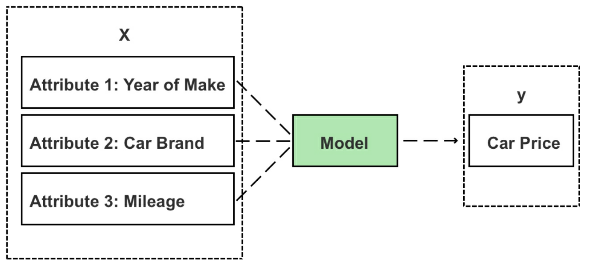
- Figure 5: Inputs (X) are fed to the model to generate a new prediction (y)

When building a supervised learning model, each item (i.e. car, product, customer) must have labeled input and output values—known in data science as a _#labeled_dataset_

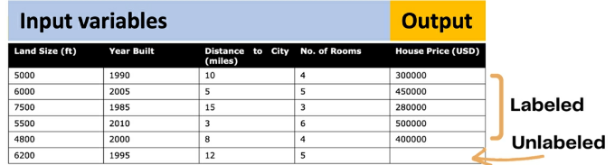
- Figure 6: Labeled data vs. unlabeled data

_#Common_algorithms_ used in supervised learning include:
- regression analysis (i.e. linear regression, logistic regression, non-linear regression), 
- decision trees, 
- k-nearest neighbors, 
- neural networks, 
- support vector machines,

### Unsupervised Learning

> _#Unsupervised_learning_: the output _variables are unlabeled_, and combinations of input and output _variables aren’t known_.

Unsupervised learning instead focuses on analyzing relationships between input variables and _uncovering hidden patterns_ that can be extracted to create new labels regarding possible outputs.

Unsupervised learning is especially compelling in the domain of fraud detection—where the most dangerous attacks are those yet to be classified.

One interesting example is DataVisor; a company that has built its business model on unsupervised learning. Founded in 2013 in California, DataVisor protects customers from fraudulent online activities, including spam, fake reviews, fake app installs, and fraudulent transactions.
- traditional solutions analyze chains of activity for a specific type of attack and then create rules to predict and detect repeat attacks. In this case, the dependent variable (output) is the event of an attack, and the independent variables (input) are the common predictor variables of an attack.
- a model that monitors combinations of independent variables, such as a large purchasing order from the other side of the globe or a landslide number of book reviews that reuse existing user content generally leads to a better prediction.
- In supervised learning, the model deconstructs and classifies what these common variables are and designs a detection system to identify and prevent repeat offenses.
- Sophisticated cybercriminals, though, learn to evade these simple classification-based rule engines by modifying their tactics.
- leverage unsupervised learning techniques to address these limitations.

The _drawback_, though, of using unsupervised learning is that because the dataset is unlabeled, there _aren’t any known output observations to check_ and validate the model, and _predictions are therefore more subjective_ than those coming from supervised learning.

### Semi-supervised Learning

Used for datasets that contain a mix of labeled and unlabeled cases.

One technique is to build the initial model using the labeled cases (supervised learning) and then use the same model to label the remaining cases (that are unlabeled) in the dataset.

### Reinforcement Learning

The goal of reinforcement learning is to achieve a specific goal (output) by _randomly trialing a vast number of possible input combinations and grading their performance_.

### Q-learning

A specific algorithmic example of reinforcement learning
- you start with a set environment of states, represented as “S.”
- In the game Pac-Man, states could be the challenges, obstacles, or pathways
- The set of possible actions to respond to these states is referred to as “A.” In Pac-Man, actions are limited to left, right, up, and down movements, as well as multiple combinations thereof.
- The third important symbol is “Q,” which is the model’s starting value and has an initial value of “0.”
- As Pac-Man explores the space inside the game, two main things happen: 
  1. Q drops as negative things occur after a given state/action. 
  2. Q increases as positive things occur after a given state/action.

A more comprehensive explanation of reinforcement learning and Q-learning using the [Pac-Man case study](https://inst.eecs.berkeley.edu/~cs188/sp12/projects/reinforcement/reinforcement.html)

## 4 THE MACHINE LEARNING TOOLBOX

### Standard Toolbox

#### Compartment 1: Data

As a beginner, it’s best to _start with (analyzing) structured data_. This means that the data is defined, organized, and labeled in a table, as shown in Table 3.

Images, videos, email messages, and audio recordings are examples of unstructured data as they don’t fit into the organized structure of rows and columns.

Contained in each column is a feature. A _#feature is also known as a variable, a dimension or an attribute_
- Rows are sometimes referred to as a _case or value_
- Each column is known also as a vector.

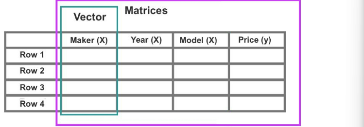
- Figure 8: The y value is often but not always expressed in the far-right vector

_Scatterplots_, including 2-D, 3-D, and 4-D plots, are also packed into the
first compartment of the toolbox with the data.

#### Compartment 2: Infrastructure

Platforms and tools for processing data: Jupyter Notebook, machine learning
libraries, including NumPy, Pandas, and Scikit-learn, server. In addition, you
may need specialized libraries for data visualization such as Seaborn and
Matplotlib, or a standalone software program like Tableau,

#### Compartment 3: Algorithms

You can find hundreds of interesting datasets in CSV format from [kaggle.com](http://kaggle.com)

Beginners typically start out using _simple supervised learning algorithms_ such as linear regression, logistic regression, decision trees, and k-nearest neighbors. Beginners are also likely to apply unsupervised learning in the form of k-means clustering and descending dimension algorithms.

#### Visualization

The visual story conveyed through graphs, scatterplots, heatmaps, box plots, and the representation of numbers as shapes make for quick and easy storytelling.

### The Advanced Toolbox

Beginners work with small datasets that are easy to handle and downloaded directly to one’s desktop as a simple CSV file. Advanced users, though, will be eager to tackle massive datasets, well in the vicinity of big data.

#### Compartment 1: Big Data

Big data is also _less likely to fit into standard rows and columns_ and may contain numerous data types, such as structured data and a range of unstructured data, i.e. images, videos, email messages, and audio files.

#### Compartment 2: Infrastructure

In 2009, Andrew Ng and a team at Stanford University made a discovery to _link inexpensive GPU clusters to run neural networks_ consisting of hundreds of millions of connected nodes.

TensorFlow is only compatible with the Nvidia GPU card.

#### Compartment 3: Advanced Algorithms

While _Scikit-learn_ offers a range of popular shallow algorithms, _TensorFlow_ is the machine learning library of choice for deep learning/neural networks.

Written in Python, _Keras_ is an open-source deep learning library that _runs on top of TensorFlow, Theano, and other frameworks_, which allows users to perform fast experimentation in fewer lines of code.

It is, however, less flexible in comparison to TensorFlow and other libraries.

Developers, therefore, will sometimes utilize _Keras to validate their decision model before switching to TensorFlow to build a more customized model_.

## 5 DATA SCRUBBING

Datasets need upfront cleaning and human manipulation before they’re ready for consumption.

### Feature Selection

> _#feature_selection_ identify which variables are most relevant to your hypothesis or objective.

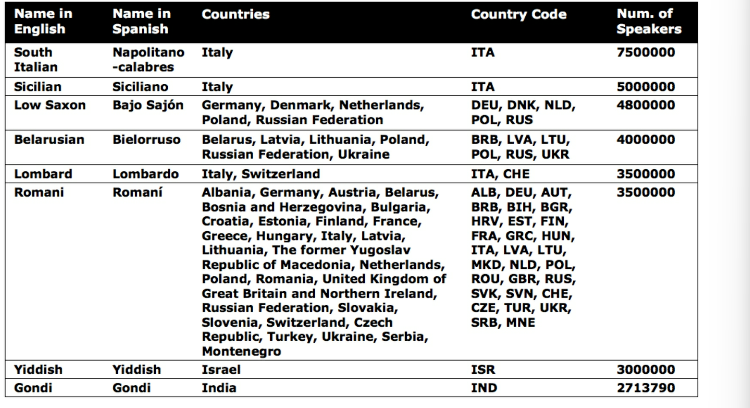
- Table 4: Endangered languages, database:
https://www.kaggle.com/the-guardian/extinct-languages

Let’s say our goal is to identify variables that contribute to a language becoming endangered. 
- Based on the purpose of our analysis, it’s unlikely that a language’s “Name in Spanish” will lead to any relevant insight. We can therefore delete this vector (column) from the dataset.
- Secondly, the dataset contains duplicated information in the form of separate vectors for “Countries” and “Country Code.”
- Another method to reduce the number of features is to roll multiple features into one,

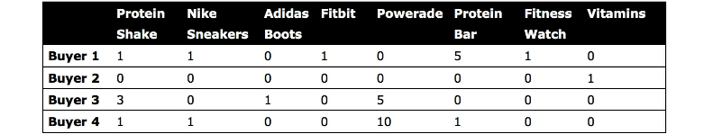
- Table 5: Sample product inventory

For instance, we can remove individual product names and replace the eight product items with fewer categories or subtypes.

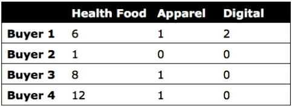
- Table 6: Synthesized product inventory

The downside to this transformation is that we have less information about the relationships between specific products.

### Row Compression

In addition to feature selection, you may need to _reduce the number of rows_

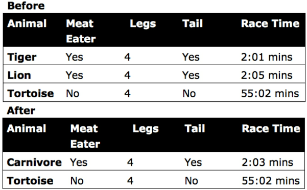
- Table 7: Example of row merge

_Non-numeric and categorical row values can be problematic to merge_ while preserving the true value of the original data. Also, row compression is usually _less attainable than feature compression_ and especially for datasets with a high number of features.

### One-hot Encoding

You next want to look for _text-based values that can be converted into numbers_.

Most algorithms are _not compatible with non-numeric data_.

> _#one-hot_encoding_: transforms values into binary form

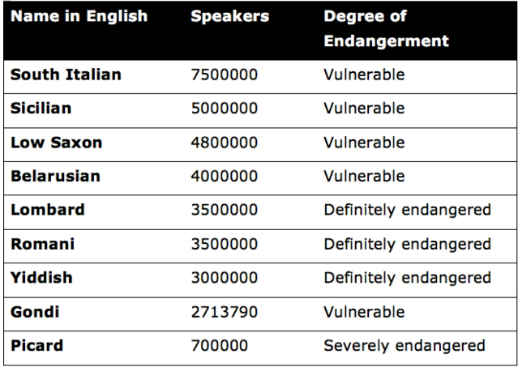
- Table 8: Endangered languages

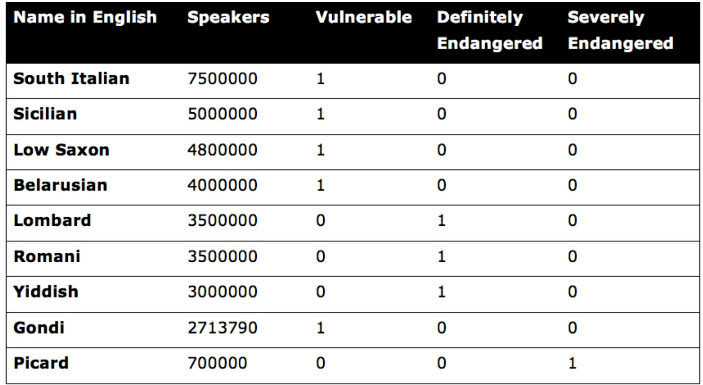
- Table 9: Example of one-hot encoding

Using one-hot encoding, the dataset has expanded to five columns, and we have created three new features from the original feature

### Binning

(also called _#bucketing_)

> _#binning_: used for converting continuous numeric values into multiple binary features called bins or buckets according to their range of values.

Let’s take house price evaluation as an example. The exact measurements of a tennis court might not matter much when evaluating house property prices;
- numeric measurements of the tennis court with a True/False feature or a categorical value such as “small,” “medium,” and “large.”
- Another alternative would be to apply one-hot encoding with “0” for homes that do not have a tennis court

### Normalization

> _#normalization_ and standardization help to improve model accuracy when used with the right algorithm.

The former (normalization) rescales the range of values for a given feature into a set range with a prescribed minimum and maximum, such as [0, 1] or [−1, 1].

This technique helps to _normalize the variance_ among the dataset’s features which may otherwise be exaggerated by another factor.

Normalization, however, _usually isn’t recommended for rescaling features with an extreme range_ as the normalized range is too narrow to emphasize extremely high or low feature values.

### Standardization

> _#standardization_: This technique converts unit variance to a _standard normal distribution_ with a mean of zero and a standard deviation (σ) of one.

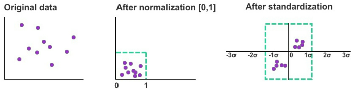
- Figure 11: Examples of rescaled data using normalization and standardization

Standardization is _generally more effective than normalization when the variability of the feature reflects a bell-curve shape of normal distribution_ and is _often used in unsupervised learning_.

Standardization is _generally recommended when preparing data for support vector machines (SVM), principal component analysis (PCA), and k-nearest neighbors (k-NN)_.

### Missing Data

Missing values in your dataset can be equally frustrating and interfere with your analysis and the model’s predictions. There are, however, _strategies to minimize the negative impact of missing data_.

One approach is to _approximate missing values_ using the mode value. This works best with categorical and binary variable types, such as one to five-star rating systems and positive/negative drug tests respectively.

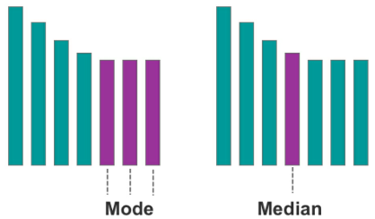
- Figure 12: A visual example of the mode and median respectively

The second approach is to _approximate missing values using the median value_. This works best with continuous variables, which have an infinite number of possible values, such as house prices.

As a last resort, _rows with missing values can be removed altogether_. The obvious downside to this approach is having less data to analyze and potentially less comprehensive insight.

## 6 SETTING UP YOUR DATA

After cleaning your dataset, the next job is to split the data into two segments for _training and testing_, also known as _#split_validation_.

Usually 70/30 or 80/20.
- training data should account for 70 percent to 80 percent
- 20 percent to 30 percent of rows are left for your test data.

Before you split your data, it’s essential that you _randomize the row order_. This helps to avoid bias in your model.

After randomizing the data, you can begin to design your model and apply it to the training data.

The next step is to _measure how well the model performed_.

Four examples of performance metrics used with classification tasks
- Area under the curve (AUC) 
- Receiver Operating Characteristic (ROC)[16], 
- Confusion matrix, 
- recall, and accuracy 

_Mean absolute error_ and _root mean square error (RMSE)_ are commonly used to assess models that provide a numeric output

Using Scikit-learn, mean absolute error is found by inputting the X values from the training data into the model and generating a prediction for each row in the dataset.

You’ll know that the model is _accurate when the error rate for the training and test dataset is low_, which means the model has learned the dataset’s underlying trends and patterns.

### Cross Validation

While split validation can be effective for developing models using existing data, question marks naturally arise over whether the model can remain accurate when used on new data.

Rather than split the data into two segments (one for training and one for testing), you can implement what’s called cross validation.

> _#Cross_validation_ maximizes the availability of training data by _splitting data into various combinations_ and testing each specific combination.

- The first method is exhaustive cross validation, which involves finding and testing all possible combinations
- The alternative and more common method is non-exhaustive cross validation, known as _#k-fold_validation_.

### K-Fold Validation


Figure 14: k-fold validation

This method, though, is _slower because the training process is multiplied_ by the number of validation sets.

### How Much Data Do I Need?

Machine learning works best when your training dataset includes a _full range of feature combinations_.

At an absolute minimum, a basic machine learning model should contain _ten times as many data points as the total number of features_.

There is a natural _diminishing rate of return_ after an adequate volume of training data (that’s widely representative of the problem) has been reached.

- For datasets with _less than 10,000_ samples, clustering and dimensionality reduction algorithms can be highly effective,
- whereas regression analysis and classification algorithms are more suitable for datasets with less than 100,000 samples.

Neural networks require even more samples to run effectively and are more cost-effective and time-efficient for working with massive quantities of data.

Scikit-learn has a cheat sheet for matching algorithms to different datasets at http://scikit-learn.org/stable/tutorial/machine_learning_map/.

## 7 LINEAR REGRESSION

As the _“Hello World”_ of supervised learning algorithms, regression analysis is a simple technique for predicting an unknown variable using the results you do know.

Using the Seinfeld TV sitcom series as our data, let’s start by plotting the two following variables, with season number as the x coordinate and the number of viewers per season (in millions) as the y coordinate.

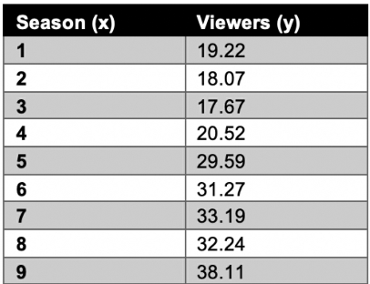
- Table 11: Seinfeld dataset

The goal of linear regression is to _split the data in a way that minimizes the distance between the hyperplane and the observed values_.

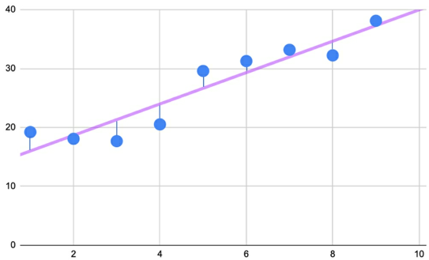
- Figure 17: Error is the distance between the hyperplane and the observed value

### The Slope

As one variable increases, the other variable will increase by the average value denoted by the hyperplane.

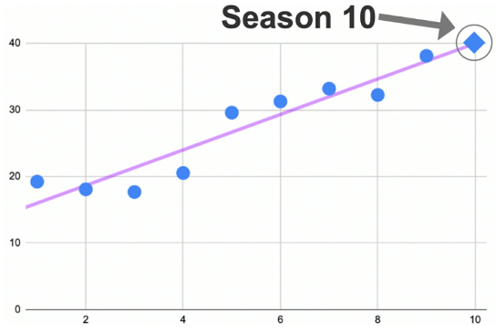
- Figure 18: Using the slope/hyperplane to make a prediction

### Linear Regression Formula

$y = bx + a$
- $a$ point where the hyperplane crosses the y-axis, known as the _y-intercept_
- $b$ dictates the steepness of the _slope_ and explains the relationship between x and y

### Calculation Example

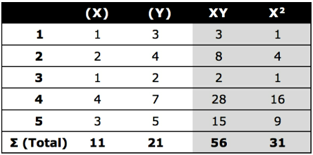
- Table 12: Sample dataset

$$
\begin{align*}
a &= \frac {(\sum y) (\sum x^2) - (\sum y) (\sum xy)} {n(\sum x^2) - (\sum x)^2} 
\\ \\
b &= \frac {n(\sum xy) - (\sum x) (\sum y)} {n(\sum x^2) - (\sum x)^2} 
\end{align*}
$$
 Where: 
 - $\sum x$ = Total sum of all x values (1 + 2 + 1 + 4 + 3 = 11) 
 - $\sum y$ = Total sum of all y values (3 + 4 + 2 + 7 + 5 = 21) 
 - $\sum xy$ = Total sum of xy for each row (3 + 8 + 2 + 28 + 15 = 56) 
 - $\sum x^2$ = Total sum of xx for each row (1 + 4 + 1 + 16 + 9 = 31) 
 - $n$ = Total number of rows. In the case of this example, n is equal to 5.

$y_i = b(x_i) + a = 1.441 (x_i) + 1.029$

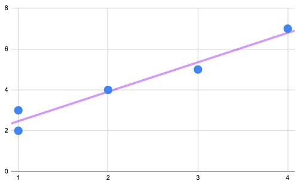
- Figure 19: y = 1.441x + 1.029 plotted on the scatterplot

### Multiple Linear Regression

The y-intercept is still expressed as a, but now there are multiple independent variables (represented as x1, x2, x3, etc.) each with their own respective coefficient (b1, b2, b3, etc).

### Discrete Variables

The output _(dependent variable) of linear regression must be continuous_ in the form of a floating-point or integer

The input _(independent variables) can be continuous or categorical_.

For categorical variables, i.e. gender, these variables must be expressed numerically using one-hot encoding

### Variable Selection

On the one hand, adding _more variables helps to account for more potential factors_ that control patterns in the data.

On the other hand, this rationale _only holds if the variables are relevant_ and possess some correlation/linear relationship with the dependent variable.

In multiple linear regression, not only are the independent variables potentially related to the dependent variable, but they are also potentially related to each other.

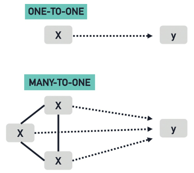
- Figure 20: Simple linear regression (above) and multiple linear regression (below)

If a strong linear correlation exists between two independent variables, this can lead to a problem called _#multi-collinearity_.

### Multi-Collinearity

When two independent variables are strongly correlated, they have a _tendency to cancel each other out_ and provide the model with little to no unique information.

Example of two multi-collinear variables are liters of fuel consumed and liters of fuel in the tank to predict how far a jet plane will fly. In this case negatively correlated; as one variables increases, the other variable decreases and vice versa.

To avoid multi-collinearity, we need to check the relationship between each combination of independent variables using a _scatterplot_, _pairplot_ (a matrix of relationships between variables), or _correlation score_.

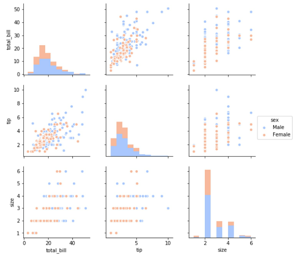
- Figure 21: Pairplot with three variables

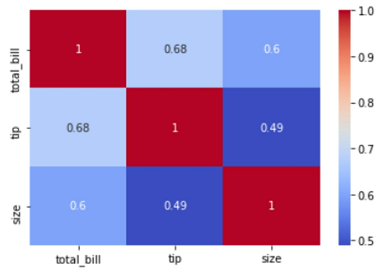
- Figure 22: Heatmap with three variables

We can also use a pairplot, heatmap or correlation score to check if the independent variables are correlated to the dependent variable (and therefore relevant to the prediction outcome).

### CHAPTER QUIZ

Using multiple linear regression, your task is to create a model to predict the tip amount guests will leave the restaurant when paying for their meal.
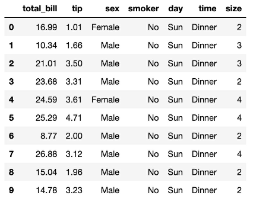

1. The dependent variable for this model should be which variable? 
	- A size 
	- B total_bill and tip 
	- C total_bill 
	- D tip
2. From looking only at the data preview above, which variable(s) appear to have a linear relationship with total_bill? 
	- A smoker 
	- B total_bill and size 
	- C time 
	- D sex
3. It’s important for the independent variables to be strongly correlated with the dependent variable and one or more of the other independent variables. 
	- True or False?

<details><summary>Ans</summary>{D, tip}, {B, total_bill & size}, {false}</details>

## 8 LOGISTIC REGRESSION

Linear regression is useful for quantifying relationships between variables to predict a continuous outcome. Total bill and size (number of guests) are both examples of continuous variables.

However, what if we want to predict a categorical variable such as “new
customer” or “returning customer”? Unlike linear regression, the _dependent
variable (y) is no longer a continuous variable (such as total tip) but rather a
discrete categorical variable_.

Logistic regression is still a _supervised learning technique but produces a
qualitative prediction_ rather than a quantitative prediction. This algorithm is
often used to predict two discrete classes, e.g., pregnant or not pregnant.

Using the sigmoid function, logistic regression finds the probability of independent variables (X) producing a discrete dependent variable (y) such as “spam” or “non-spam.”

$$\begin{align*}
y = \frac {1}{1 + e^{-x}}
\end{align*} $$
Where: 
- $x$ = the independent variable you wish to transform 
- $e$ = Euler's constant, 2.718

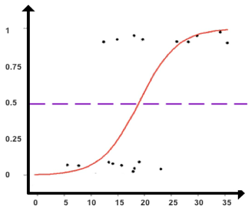
- Figure 23: A sigmoid function used to classify data points

### Sigmoid Function

The _#sigmoid_function_ produces an S-shaped curve that can convert any number and map it into a numerical value between 0 and 1 but without ever reaching those exact limits. Applying this formula, the sigmoid function converts independent variables into an expression of _probability between 0 and 1_ in relation to the dependent variable.

Based on the found probabilities of the independent variables, logistic regression assigns each data point to a discrete class.

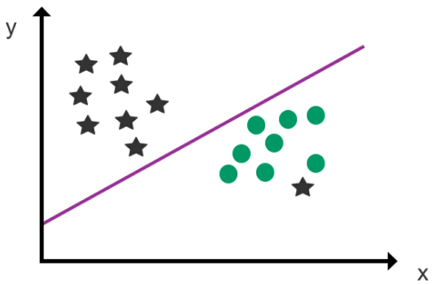
- Figure 24: An example of logistic regression

Although logistic regression shares a visual resemblance to linear regression,
the _logistic hyperplane_ represents a classification/decision boundary rather
than a prediction trendline. Instead of using the hyperplane to make numeric
predictions, the hyperplane is used to _divide the dataset into classes_.

The other distinction between logistic and linear regression is that the
dependent variable (y) isn’t placed along the y-axis in logistic regression.
Instead, independent variables can be plotted along both axes, and the class
(output) of the dependent variable is determined by the position of the data
point in relation to the decision boundary.

### Multinomial Logistic Regression

For classification scenarios with more than two possible discrete outcomes,
multinomial logistic regression can be used

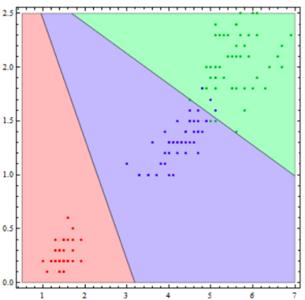
Figure 25: An example of multinomial logistic regression

Two tips to remember when using logistic regression are that 
1. the dataset should be free of missing values 
2. that all independent variables are independent and not strongly correlated with each other.

[Statistics 101: Logistic Regression, An Introduction - YouTube](https://www.youtube.com/watch?v=zAULhNrnuL4&list=PLIeGtxpvyG-JmBQ9XoFD4rs-b3hkcX7Uu)

### CHAPTER QUIZ

Using logistic regression, your task is to classify penguins into different classes based on the following dataset.

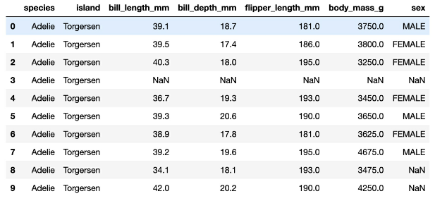

1. Which three variables (in their current form) could we use as the dependent variable to classify penguins?   
2. Which row(s) contains missing values?   
3. Which variable in the dataset preview is binary?

<details><summary>Ans</summary>
1. species, island, sex
2. 3,8,9
3. sex
</details>

## 9 k-NEAREST NEIGHBORS

_#k-NN_ classifies new data points based on their _position to nearby data points_. Similar to a voting system

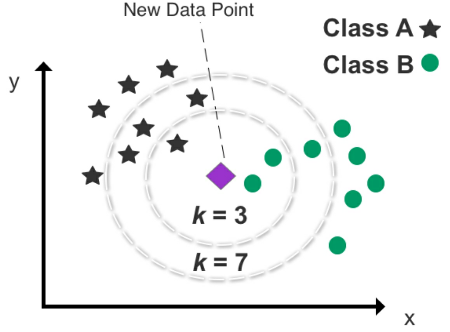
- Figure 26: An example of k-NN clustering used to predict the class of a new data point
- set $k$ to determine how many data points we want to use to classify the new data
- If we set k to 3, k-NN analyzes the new data point’s position with respect to the three nearest data points (neighbors).
- The outcome of selecting the three closest neighbors returns two Class B data points and one Class A data point.
- It’s therefore useful to test numerous k combinations to find the best fit and avoid setting k too low or too high.
- Setting k too low will increase bias and lead to misclassification
- setting k too high will make it computationally expensive.

Five is the default number of neighbors for this algorithm using Scikit-learn.

This algorithm _works best with continuous variables_.

While k-NN is generally accurate and easy to comprehend, storing an entire dataset and calculating the distance between each new data point and all existing data points puts a heavy burden on computing resources. NN is _generally not recommended for analyzing large datasets_.

Another downside is that it can be challenging to apply k-NN to high-dimensional data with a high number of features.

### CHAPTER QUIZ

Classify penguins into different species using the k-nearest neighbors algorithm, with k set to 5 (neighbors).


1. Which of the following variables should we consider removing from our k-NN model? 
	- A. sex
	- B. species
	- C. body_mass_g
	- D. bill_depth_mm
1. If we wanted to reduce the processing time of our model, which of the following methods is recommended? 
   - A. Increase k from 5 to 10 
   - B. Reduce k from 10 to 5 
   - C. Re-run the model and hope for a faster result 
   - D. Increase the size of the training data
2. To include the variable ‘sex’ in our model, which data scrubbing technique do we need to use?

<details><summary>ANS</summary>
<li>1. A, sex (Binary variables should only be used when critical to the model’s accuracy.)   
<li>2. B, Reduce k from 10 to 5   
<li>3. One-hot encoding (to convert the variable into a numerical identifier of 0 or 1)
</details>

## 10 k-MEANS CLUSTERING

> _#k-means_clustering_ is grouping or clustering data points that share similar attributes using unsupervised learning.

An online business, for example, wants to examine a segment of customers that purchase at the same time of the year and discern what factors influence their purchasing behavior.

As an unsupervised learning algorithm, k-means clustering attempts to _divide data into k number of discrete groups_ and is highly effective at uncovering new patterns.

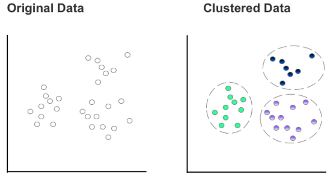
- Figure 29: Comparison of original data and clustered data using k-means

- Split data into k number of clusters, with k representing the number of clusters you wish to create.
- Examine the unclustered data and manually select a centroid for each cluster. That centroid then forms the epicenter of an individual cluster.
- The remaining data points on the scatterplot are then assigned to the nearest centroid by measuring the Euclidean distance.
- Each data point can be assigned to only one cluster, and each cluster is discrete.
- No overlap between clusters and no case of nesting a cluster inside another cluster.
- After all data points have been allocated to a centroid, the next step is to aggregate the mean value of the data points in each cluster, which can be found by calculating the average x and y values of the data points contained in each cluster.
- Next, take the mean value of the data points in each cluster and plug in those x and y values to update your centroid coordinates. This will most likely result in one or more changes to the location of your centroid(s).
- Like musical chairs, the remaining data points rush to the closest centroid to form k number of clusters.
- Should any data point on the scatterplot switch clusters with the changing of centroids, the previous step is repeated.


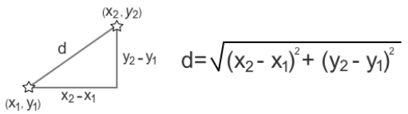
- Figure 30: Calculating Euclidean distance

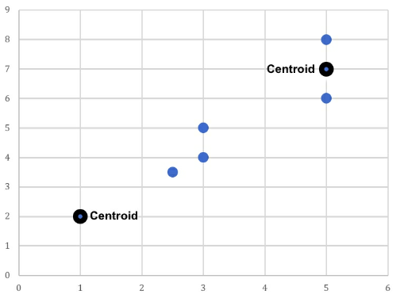
- Figure 32: Two existing data points are nominated as the centroids

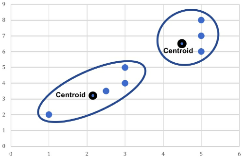
- Figure 34: The centroid coordinates for each cluster are updated to reflect the cluster’s mean value. The two previous centroids stay in their original position and two new centroids are added to the scatterplot. Lastly, as one data point has switched from the right cluster to the left cluster, the centroids of both clusters need to be updated one last time.

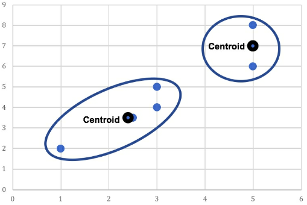
- Figure 35: Two final clusters are produced based on the updated centroids for each cluster

### Setting k

In general, _as k increases, clusters become smaller and variance falls_. However, the downside is that neighboring clusters become less distinct from one another as k increases.

If you set k to the same number of data points in your dataset, each data point automatically becomes a standalone cluster.

In order to optimize k, you may wish to use a scree plot for guidance.

### Scree Plot

> _#Scree_plot_ charts the _degree of scattering_ (variance) inside a cluster as the total number of clusters increases.

A scree plot compares the _Sum of Squared Error #SSE_ for each variation of total clusters.

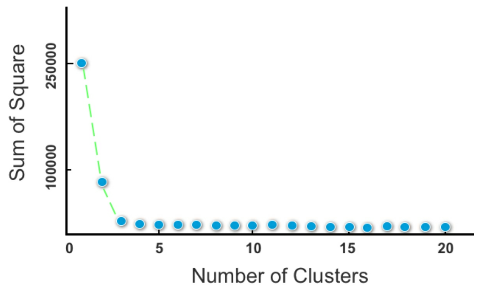
- Figure 36: A scree plot

In general, you should _opt for a cluster solution where SSE subsides
dramatically to the left_ on the scree plot but before it reaches a point of
negligible change with cluster variations to its right.

Another useful technique to decide the number of cluster solutions is to divide
the total number of data points (n) by two and finding the square root $\sqrt(n/2)$.

A more simple and non-mathematical approach to setting k is to _apply domain knowledge_.

e.g. If I am analyzing data about visitors to the website. Because I already know there is a significant discrepancy in spending behavior between returning visitors and new visitors. But understand that the effectiveness of “domain knowledge” diminishes dramatically past a low number of k clusters.

Domain knowledge might be sufficient for determining two to four clusters but less valuable when choosing between a higher number of clusters, such as 20 or 21 clusters.

### CHAPTER QUIZ   

Your task is to group the flights dataset (which tracks flights from 1949 to 1960) into discrete clusters using k-means clustering.

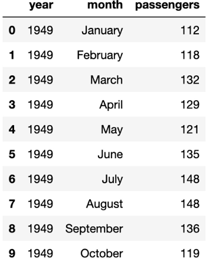
1. Using k-means clustering to analyze all 3 variables, what might be a good initial number of k clusters (using only domain/general knowledge) to train the model? 
- k = 2 
- k = 100 
- k = 12 
- k = 3

2. What mathematical technique might we use to find the appropriate number of clusters?
- A. Big elbow method 
- B. Mean absolute error 
- C. Scree plot 
- D. One-hot encoding

3. Which variable requires data scrubbing?

<details><summary>Ans</summary>
<li>12 (months)
<li>C (scree plot)
<li>month
</details>

## 11 BIAS & VARIANCE

Most algorithms have many different hyperparameters also leads to a vast number of potential outcomes.

Example of hyperparameters in Python for the algorithm gradient boosting
```python
model = ensemble.GradientBoostingRegressor(n_estimators=150,
										  learning_rate=0.1,
										  max_depth=4,
										  min_samples_split=4,
										  min_samples_leaf=4,
										  max_features=0.5,
										  loss='huber'
										  )
```

A constant challenge in machine learning is navigating underfitting and overfitting, which describe how closely your model follows the actual patterns of the data.

### Bias

> _#Bias_ refers to the gap between the value predicted by your model and the actual value of the data.

In the case of high bias, your predictions are likely to be skewed in a particular direction away from the true values.

### Variance

> _#Variance_ describes how scattered your predicted values are in relation to each other.

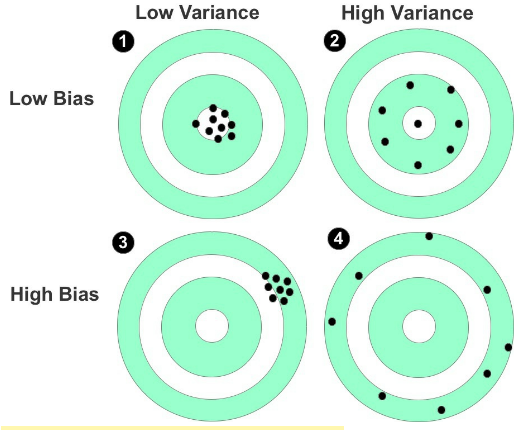
- Figure 38: Shooting targets used to represent bias and variance

### Prediction Error

Ideally, you want a situation where there’s both low variance and low bias. In reality, however, there’s a _trade-off between optimal bias and optimal variance_. Bias and variance _both contribute to error but it’s the prediction error that you want to minimize_, not the bias or variance specifically.

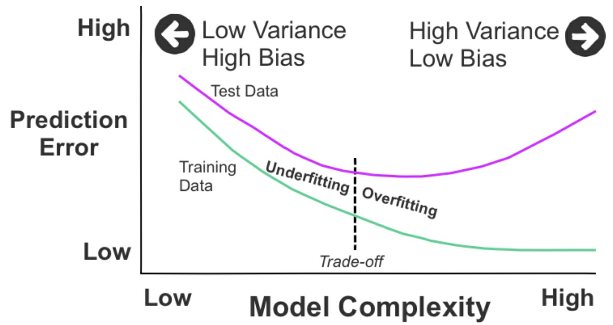
- Figure 39: Model complexity based on the prediction error

In Figure 39, we can see two curves. The upper curve represents the test data, and the lower curve depicts the training data. From the left, both curves begin at a point of high prediction error due to low variance and high bias. As they move toward the right, they change to the opposite: high variance and low bias.

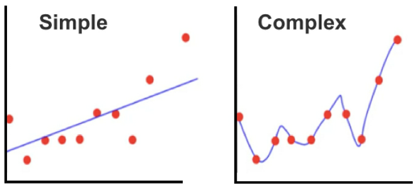
- Figure 40: _Underfitting_ on the left and _overfitting_ on the right

### Underfitting / Overfitting

The model being overly simple and inflexible (underfitting) or overly complex and flexible (overfitting). _#Underfitting_ (low variance, high bias) on the left and _#overfitting_ (high variance, low bias) on the right are shown in these two scatterplots.

A natural temptation is to add complexity to the model (as shown on the right) to improve accuracy, but this can, in turn, lead to overfitting.

Underfitting is when your model is overly simple, and again, has not scratched the surface of the underlying patterns in the data.

An advanced strategy to combat overfitting is to introduce regularization, which reduces the risk of overfitting by constraining the model to make it simpler.

One other technique to improve model accuracy is to perform cross validation, as covered earlier in Chapter 6, to minimize pattern discrepancies between the training data and the test data.

## 12 SUPPORT VECTOR MACHINES

_#SVM_ is mostly used as a classification technique for _predicting categorical outcomes_.

SVM is _similar to logistic regression_, in that it’s used to filter data into a binary or multiclass target variable.

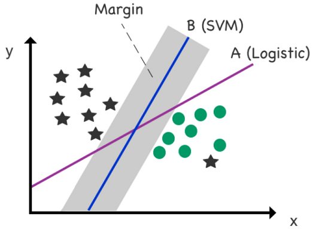
- Figure 41: Logistic regression versus SVM. Gray zone denotes _margin_, which is the distance between the decision boundary and the nearest data point, multiplied by two.

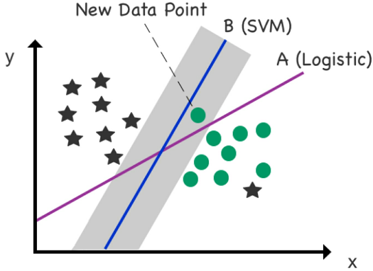
- Figure 42: A new data point is added to the scatterplot. The new data point is a circle, but it’s located incorrectly on the left side of the logistic (A) _decision boundary_. The new data point, though, remains correctly located on the right side of the SVM (B) decision boundary (designated for circles) courtesy of ample “support” supplied by the margin.

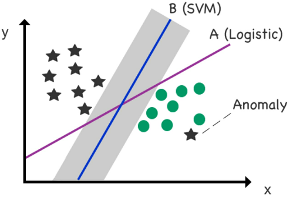
Figure 43: Mitigating _anomalies_. 

A limitation of standard logistic regression is that it goes out of its way to fit outliers and anomalies. SVM, however, is less sensitive to such data points and actually minimizes their impact on the final location of the boundary line.

The SVM boundary can also be modified to ignore misclassified cases in the training data using a hyperparameter called C.

There is therefore a trade-off in SVM between a wide margin/more mistakes and a narrow margin/fewer mistakes. Adding flexibility to the model using the _hyperparameter C_ introduces what’s called a _“soft margin,”_ which ignores a determined portion of cases that cross over the soft margin—leading to greater generalization in the model.

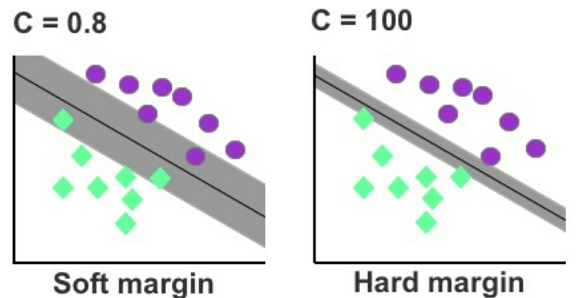
- Figure 44: Soft margin versus hard margin

SVM’s real strength lies with high-dimensional data and handling multiple features. SVM has numerous advanced variations available to classify high-dimensional data using what’s called the Kernel Trick.

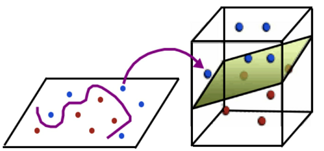
- Figure 45: In this example, the decision boundary provides a non-linear separator between the data in a 2-D space but transforms into a linear separator between data points when projected into a 3-D space with a low feature-to-row ratio (low number of features relative to rows) due to speed and performance constraints.

SVM does, though, excel at untangling outliers from complex small and medium-sized datasets and managing high-dimensional data.

### CHAPTER QUIZ   

Using an SVM classifier, your task is to classify which island a penguin has come from after arriving on your own island.

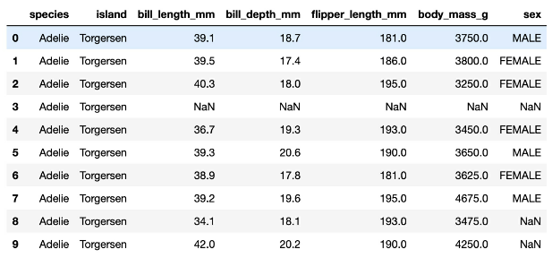

1. Which of the following variables would be the dependent variable for this model? 
- A. island 
- B. species 
- C. sex 
- D. body_mass_g

3. Which of the following variables could we use as independent variable(s)? 
- A. island 
- B. All of the variables 
- C. All of the variables except island 
- D. species

5. What are two data scrubbing techniques commonly used with this algorithm?

<details><summary>Ans</summary>
<li>A. island
<li>C. All except island
<li>regularization and standardization
</details>

## 13 ARTIFICIAL NEURAL NETWORKS

> _#ANN_ (_#Artificial_Neural_Network_) is analyzing data through a network of decision layers.

The naming of this technique was inspired by the algorithm’s structural resemblance to the human brain.

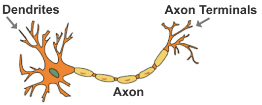
- Figure 46: Anatomy of a human brain neuron

Artificial neural networks consist of interconnected decision functions, known as _nodes_, which interact with each other through axon-like edges.

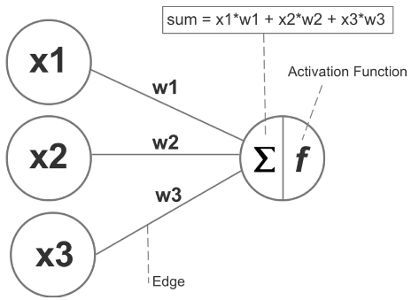
- Figure 47: The nodes, edges/weights, and sum/activation function of a basic neural network

Each edge in the network has a numeric weight that can be altered based on experience. The sum of the connected edges satisfies a set threshold, known as the activation function, this activates a neuron at the next layer.

Using supervised learning, the model’s predicted output is compared to the actual output (that’s known to be correct), and the difference between these two results is measured as the cost or _cost value_. The purpose of training is to reduce the cost value until the model’s prediction closely matches the correct output.

This is achieved by incrementally tweaking the network’s weights until the lowest possible cost value is obtained. This particular process of training the neural network is called _#back-propagation_.

### The Black-box Dilemma

Although the network can approximate accurate outputs, tracing its decision
structure reveals _limited to no insight into how specific variables influence_
its decision.

For instance, if we use a neural network to predict the outcome of a Kickstarter campaign (an online funding platform for creative projects), the network can analyze numerous independent variables including campaign category, currency, deadline, and minimum pledge amount, etc.

However, the model is unable to specify the relationship of these independent variables to the dependent variable of the campaign reaching its funding target.

Moreover, _it’s possible for two neural networks with different topologies and weights to produce the same output_, which makes it even more challenging to trace the impact of specific variables

Neural networks generally fit prediction tasks with a large number of input features and complex patterns, especially problems that are difficult for computers to decipher but simple and almost trivial for humans.

- One example is the CAPTCHA
- Another example is identifying if a pedestrian is preparing to step into the path of an oncoming vehicle.

In both examples, obtaining a fast and accurate prediction is more important than decoding the specific variables and their relationship to the final output.

### Building a Neural Network

A typical neural network can be divided into input, hidden, and output layers.

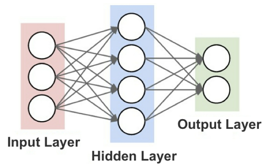
- Figure 48: The three general layers of a neural network

While there are many techniques to assemble the nodes of a neural network, the simplest method is the feed-forward network where signals flow only in one direction and there’s no loop in the network.

### Perceptron

The most basic form of a feed-forward neural network is the _#perceptron_

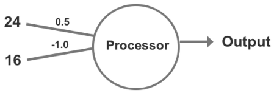
- Figure 50: Weights are added to the perceptron

Next, we multiply each weight by its input: 
- Input 1: 24 * 0.5 = 12 
- Input 2: 16 * -1 = -16
- Sum (Σ): 12 + -16 = -4
- As a numeric value less than zero, the result produces “0” and does not trigger the perceptron’s activation function.

- Input 1: 24 * 0.5 = 12 
- Input 2: 16 * -0.5 = -8 
- Sum (Σ): 12 + -8 = 4
- As a positive outcome, the perceptron now produces “1” which triggers the activation function,

A weakness of a perceptron is that because the output is binary (0 or 1), small changes in the weights or bias in any single perceptron within a larger neural network can _induce polarizing results_.

### Sigmoid Neuron

An alternative to the perceptron is the sigmoid neuron. Similar to a perceptron, but the presence of a _#sigmoid_function_ rather than a binary filter

While more flexible than a perceptron, a sigmoid neuron is _unable to generate negative values_.

### Hyperbolic Tangent Function

Third option is the _#hyperbolic_tangent_function_.

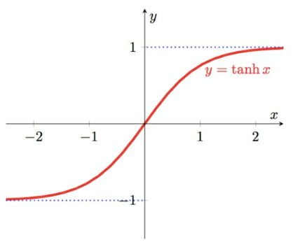
- Figure 53: A hyperbolic tangent function graph

### Multilayer Perceptrons

_#multilayer_perceptron_ is an algorithm for predicting a categorical (classification) or continuous (regression) target variable. Powerful because they aggregate multiple models into a _unified prediction model_

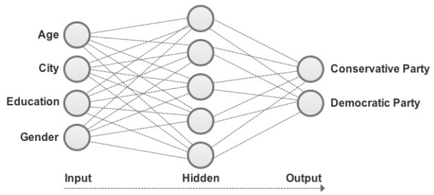
- Figure 54: A multilayer perceptron used to classify a social media user’s political preference

Ideal for interpreting _large and complex datasets with no time or computational restraints_. Less compute-intensive algorithms, such as decision trees and logistic regression, for example, are more efficient for working with smaller datasets.

### Deep Learning

As patterns in the data become more complicated—especially a shallow model is no longer reliable or capable of sophisticated analysis because the model becomes _exponentially complicated_ as the number of inputs increases.

A _#neural_network_, with a deep number of layers, though, can be used to interpret a high number of input features and break down complex patterns into simpler patterns, as shown in Figure 55.

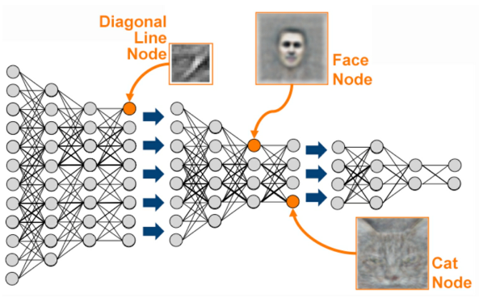
- Figure 55: Facial recognition using deep learning. Source: kdnuggets.com

What makes deep learning _“deep” is the stacking of at least 5-10 node layers_.

Object recognition, as used by self-driving cars to recognize objects such as pedestrians and other vehicles, uses upward of 150 layers and is a popular application of deep learning.

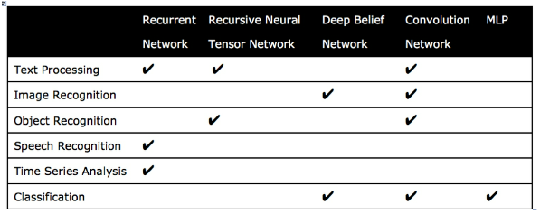
- Table 13: Common usage scenarios and paired deep learning techniques

Multilayer perceptrons _(MLP) have largely been superseded by new deep learning techniques_ such as _#convolution_networks_, _#recurrent_networks_, _#deep_belief_networks_, and _#recursive_neural_tensor_networks_ (RNTN).

### CHAPTER QUIZ   
Using a multilayer perceptron, your job is to create a model to classify the gender sex) of penguins that have been affected and rescued during a natural disaster. However, you can only use the physical attributes of penguins to train your model.


1. How many output nodes does the multilayer perceptron need to predict the dependent variable of sex (gender)?

2. Which of the seven variables could we use as independent variables based on only the penguin’s physical attributes?

3. Which is a more transparent classification algorithm that we could use in replace of a multilayer perceptron? 
- A. Simple linear regression 
- B. Logistic regression 
- C. k-means clustering 
- D. Multiple linear regression

<details><summary>Ans</summary>
<li>2 (male/female)
<li>4: bill length, bill depth, flipper length, body mass
<li>B. Logistic Regression 
</details>

## 14 DECISION TREES

Downsides of Neural Neworks:
- Huge amount of input data and computational resources required to train 
- _Black-box dilemma_, which conceals the model’s decision structure.

Decision trees, on the other hand, are transparent and easy to interpret. They work with less data and consume less computational resources.

_#Decision_trees_ are used primarily for solving _classification problems_ but can also be _used as a regression model_ to predict numeric outcomes.


- Figure 56: Example of a regression tree
o
- Figure 57: Example of a classification tree

Building a Decision Tree
- start with a _root node_ that acts as a starting point 
- followed by splits that produce branches, also known as _edges_.
- branches link to leaves, also known as _nodes_, which form _decision points_.
- Aim is to keep the tree as small as possible. This is achieved by selecting a variable that optimally _splits the data into homogenous groups_
- we want the data at _each layer to be more homogenous_ than the previous partition.
- want to pick a _greedy algorithm_ that can reduce entropy at each layer of the tree. An example of a greedy algorithm is the Iterative Dichotomizer (ID3), invented by J.R. Quinlan.


- Table 14: Employee characteristics


Black = Promoted, White = Not Promoted
- Exceeded KPI: 
- Leadership Capability: 
- Aged Under 30: 

### Calculating Entropy

$(-p_1 logp_1 - p_2 logp_2) / log2$

- Exceeded KPI:
	- Yes: $p_1 = [6,6]$ $p_2 = [0,6]$
	- No: $p_1 = [0,4]$ $p_2 = [4,4]$
	- $(-6 / 6*log6/6 - 0 / 6*log0/6) / log2 = 0$
	- $(-0 / 4*log4/4 - 4 / 4*log0/4) / log2 = 0$
	- entropy = $0*0$
- Leadership Capability
	- Yes: $p_1 = [2,4]$ $p_2 = [2,4]$
	- No: $p_1 = [4,6]$ $p_2 = [2,6]$
	- $(-2 / 4*log2/4 - 2 / 4*log2/4) / log2 = 1$
	- $(-4 / 6*log4/6 - 2 / 6*log2/6) / log2 = 0.9182...$
	- entropy = $(4/10)*0 + (6/10)*0.918 = 0.9508$
- Aged under 30
	- Yes: $p_1 = [3,7]$ $p_2 = [4,7]$
	- No: $p_1 = [3,3]$ $p_2 = [0,3]$
	- $(-3 / 7*log3/7 - 4 / 7*log4/7) / log2 = 0.985...$
	- $(-3 / 3*log3/3 - 0 / 3*log0/3) / log2 = 0$
	- entropy = $(7/10)*0.985 + (3/10)*0 = 0.6895$

Exceeded KPI generates the "perfect classification (0)", followed by Age.

### Overfitting

The variable used to first split the data does not guarantee the most accurate model at the end of production.

Thus, although decision trees are highly visual and effective at classifying a single set of data, they are also _inflexible and vulnerable to overfitting, especially for datasets with high pattern variance_.

### Bagging

Involves _growing multiple decision trees using a randomized selection_ of input data for each tree and combining the results by averaging the output (for regression) or voting (for classification).

### Random Forests

Artificially limit the choice of variables by capping the number of variables considered for each split.


- Figure 58: Example of growing random trees to produce a prediction

Scott Hartshorn _advises focusing on optimizing other hyperparameters before
adding more trees_ to the initial model, as this will reduce processing time in
the short term and increasing the number of trees later should

Other techniques including _gradient boosting_ tend to return superior prediction accuracy.

Random forests, though, are fast to train and work well for obtaining a quick benchmark model.

### (Gradient) Boosting

Boosting is _combining “weak” models into one “strong”_ model. This is achieved by _adding weights_ to trees based on misclassified cases in the previous tree.

One of the more popular boosting algorithms is _gradient boosting_. Rather than selecting combinations of variables at random, gradient boosting selects variables that improve prediction accuracy with each new tree.


- Figure 59: Example of reducing prediction error across multiple trees to produce a prediction

Boosting also _mitigates the issue of overfitting_ and it does so using fewer trees than random forests.

While adding more trees to a random forest usually helps to offset overfitting, the same process can cause overfitting in the case of boosting.

Overfitting can be explained by their highly-tuned focus on learning and reiterating from earlier mistakes. It can lead to mixed results in the case of data stretched by a high number of outliers.

The other main downside of boosting is the _slow processing speed_ that comes with training a sequential decision model.

### CHAPTER QUIZ   
Your task is to predict the body mass (body_mass_g) of penguins using the penguin dataset and the random forests algorithm.


1. Which variables could we use as independent variables to train our model? 
2. To train a quick benchmark model, gradient boosting is faster to train than random forests. 
	- True or False?
3. Which tree-based technique can be easily visualized? 
	- A. Decision trees 
	- B. Gradient boosting 
	- C. Random forests

<details><summary>Ans</summary>
<li>All variables except for body_mass_g (Tree-based techniques work well with both discrete and continuous variables as input variables.)
<li>False (Gradient boosting runs sequentially, making it slower to train. A random forest is trained simultaneously, making it faster to train.)
<li>A, Decision trees
</details>

## 15 ENSEMBLE MODELING

By _combining the output of different models_ (instead of relying on a single estimate), ensemble modeling helps to _build a consensus_ on the meaning of the data.

In the case of classification, multiple models are consolidated into a single prediction using a _voting system_. It can also be divided into sequential or parallel and homogenous or heterogeneous.

### Sequential and Parallel Models

For _#sequential_models_, the prediction error is reduced by _adding weights to classifiers that previously misclassified_ data.
- _Gradient boosting_ and _AdaBoost_ (designed for classification problems) are both examples of sequential models.

_#Parallel_ensemble_models_ work concurrently and reduce error by averaging.
- _Random forests_ are an example of this technique.
- Ensemble models can be generated using a single technique with numerous variations, known as a _homogeneous ensemble_, or through different techniques, known as a _heterogeneous ensemble_.
- An example of a _homogeneous_ ensemble model would be _multiple decision trees_ working together to form a single prediction (i.e. bagging).
- An example of a _heterogeneous_ ensemble would be the usage of _k-means clustering_ or a _neural network_ in collaboration with a decision tree algorithm.

It’s important to select techniques that complement each other.
- Neural networks, for instance, require complete data for analysis, whereas decision trees are competent at handling missing values.[28]
- Together, these two techniques provide added benefit over a homogeneous model.

There are four main methods: bagging, boosting, a bucket of models, and stacking.

### Bucket of Models

Bucket of models trains multiple different algorithmic models using the same training data and then picks the one that performed most accurately on the test data.

### Bagging

Bagging, as we know, is an example of parallel model averaging using a homogenous ensemble, which draws upon randomly drawn data and combines predictions to design a unified model.

### Boosting

Boosting is a popular alternative technique that is still a homogenous ensemble but addresses errors and data misclassified by the previous iteration to produce a sequential model.

### Stacking

Stacking runs multiple models simultaneously on the data and combines those results to produce a final model.

Unlike boosting and bagging, stacking usually combines outputs from different algorithms (heterogenous) rather than altering the hyperparameters of the same algorithm (homogenous).


- Figure 60: Stacking algorithm

The gains of using a stacking technique are marginal in line with the level of complexity, and organizations usually opt for the ease and efficiency of boosting or bagging.

The _#Netflix_Prize_competition_, held between 2006 and 2009, offered a prize for a machine learning model that could significantly improve Netflix’s content recommender system. One of the winning techniques, from the team BellKor’s Pragmatic Chaos, adopted a form of linear stacking that blended predictions from hundreds of different models using different algorithms.

## 16 DEVELOPMENT ENVIRONMENT

(http://jupyter.org/install.html)

(https://www.anaconda.com/products/individual/).

The Melbourne_housing_FULL dataset can be downloaded from this link: https://www.kaggle.com/anthonypino/melbourne-housing-market/.

```python
import pandas as pd
df = pd.read_csv('~/Downloads/Melbourne_housing_FULL.csv')  # load into dataframe
df.head()     # preview the dataframe
df.iloc[100]  # row 101
df.columns    # headers
```

## 17 BUILDING A MODEL IN PYTHON

```python
import pandas as pd 
from sklearn.model_selection  import train_test_split 
from sklearn                  import ensemble 
from sklearn.metrics          import mean_absolute_error

df = pd.read_csv('~/Downloads/Melbourne_housing_FULL.csv')  # load data into dataframe

# Data Scrubbbing: remove unnecessary data
# The misspellings of “longitude” and “latitude” are preserved here 
# The remaining eleven independent variables from the dataset are Suburb, Rooms,
# Type, Distance, Bedroom2, Bathroom, Car, Landsize, BuildingArea, YearBuilt, and
# CouncilArea.
del df['Address']; del df['Method']; del df['SellerG']; del df['Date']; del df['Postcode']; del df['Lattitude']; del df['Longtitude']; del df['Regionname']; del df['Propertycount'];
# The twelfth variable is the dependent variable which is Price.

# remove rows with missing values
df.dropna(axis = 0, how = 'any', subset = None, inplace = True)   

# one-hot encoFing
df = pd.get_dummies(df, columns = ['Suburb', 'CouncilArea', 'Type'])

# Assign 'Price' as (dependent) Y, others are independent X  
y = df['Price']
X = df.drop('Price',axis=1) 
X_train, X_test, y_train, y_test = train_test_split(X, y, test_size = 0.3, shuffle = True)

# Assign our chosen algorithm (gradient boosting regressor) 
# as a new variable (model) 
# and configure its hyperparameters
model = ensemble.GradientBoostingRegressor(n_estimators = 150,  # No. decision trees
										   learning_rate = 0.1, # influence of new trees    
										   max_depth = 30,      # max layers
										   min_samples_split = 4, # min samples to split
										   min_samples_leaf = 6, # min samples per leaf
										   max_features = 0.6,   # number features to split
										   loss = 'huber' )     # 

# The first line is the algorithm itself (gradient boosting)
# n_estimators states the number of decision trees.
#     a high number of trees generally improves accuracy (up to a certain point) 
#     but will inevitably extend the model’s processing time.
# learning_rate controls the rate at which additional decision trees influence the overall prediction.
#     Inserting a low rate here, such as 0.1, should help to improve accuracy.
# max_depth defines the maximum number of layers (depth) for each decision tree.
#     If “None” is selected, then nodes expand until all leaves are pure 
#     or until all leaves contain less than min_samples_leaf.
# min_samples_split defines the minimum samples required to execute a new binary split.
# min_samples_leaf represents the minimum samples that must appear in each child node (leaf) before a new branch can be implemented.
# max_features is the total number of features presented to the model when determining the best split.
# loss calculates the model's error rate.
# we are using huber which protects against outliers and anomalies.
# Alternative error rate options include ls (least squares regression), lad (least absolute deviations), and quantile (quantile regression).

# fit() function from Scikit-learn to link the training data to the learning algorithm stored in the variable model to train the prediction model.
model.fit(X_train, y_train)

# predict() function from Scikit-learn to run the model on the X_train data and evaluate its performance against the actual y_train data.
mae_train = mean_absolute_error(y_train, model.predict(X_train)) 
print ("Training Set Mean Absolute Error: %.2f" % mae_train)

mae_test = mean_absolute_error(y_test, model.predict(X_test)) 
print ("Test Set Mean Absolute Error: %.2f" % mae_test)
# output:
# Training Set Mean Absolute Error: 27256.70  
# Test Set Mean Absolute Error: 166103.04
```

For this model, our _training set’s mean absolute error_ is $27,256.70, and the _test set’s mean absolute error_ is $166,103.04.
- While $27,256.70 may seem like a lot of money, this average error value is low given the maximum range of our dataset is $8 million.
- A high discrepancy between the training and test data is usually an indicator of overfitting in the model.

mini course at https://scatterplotpress.com/p/house-prediction-model ^minicourse

## 18 MODEL OPTIMIZATION

We want to improve its prediction accuracy with future data and reduce the effects of overfitting.

### Modify Hyperparameters

Starting point is to modify the model’s hyperparameters.
- Holding the other hyperparameters constant, let’s begin by adjusting the maximum depth from “30” to “5.”
- Although the mean absolute error of the training set is now higher, this helps to reduce the issue of overfitting and should improve the model’s performance.

### More Trees

Another step to optimize the model is to add more trees. If we set `n_estimators` = $250$. This second optimization reduces the training set’s absolute error rate by approximately $10,000

While manual trial and error can be a useful technique to understand the impact of variable selection and hyperparameters, there are also automated techniques for model optimization, such as grid search.

### Grid Search

Grid search allows you to list a range of configurations you wish to test for each hyperparameter and methodically test each

Grid search does _take a long time to run_! It sometimes helps to run a relatively coarse grid search using consecutive powers of 10 (i.e. 0.01, 0.1, 1, 10) and then run a finer grid search around the best value identified.

### Randomized Search Method
Another way of optimizing algorithm hyperparameters is the randomized search method using Scikit-learn’s `RandomizedSearchCV`.
- more advanced tutorial available at https://scatterplotpress.com/p/house-prediction-model.

### Code for the Optimized Model

```python
import pandas as pd 
from sklearn.model_selection import train_test_split 
from sklearn import ensemble 
from sklearn.metrics import mean_absolute_error 

# Read in data from CSV 
df = pd.read_csv('~/Downloads/Melbourne_housing_FULL.csv') 

# Delete unneeded columns 
del df['Address'];
del df['Method'];
del df['SellerG'];
del df['Date'];
del df['Postcode'];
del df['Lattitude'];
del df['Longtitude'];
del df['Regionname'];
del df['Propertycount'];

# Remove rows with missing values 
df.dropna(axis = 0, how = 'any', subset = None, inplace = True) 

# Convert non-numeric data using one-hot encoding 
df = pd.get_dummies(df, columns = ['Suburb', 'CouncilArea', 'Type']) 

# Assign X and y variables 
X = df.drop('Price',axis=1) 
y = df['Price'] 

# Split data into test/train set (70/30 split) and shuffle 
X_train, X_test, y_train, y_test = train_test_split(X, y, test_size = 0.3, shuffle = True) 

# Set up algorithm 
model = ensemble.GradientBoostingRegressor(n_estimators = 250,
										   learning_rate = 0.1,
										   max_depth = 5,
										   min_samples_split = 10,
										   min_samples_leaf = 6,
										   max_features = 0.6,
										   loss = 'huber' ) 

# Run model on training data  
model.fit(X_train, y_train)

# Check model accuracy (up to two decimal places) 
mae_train = mean_absolute_error(y_train, model.predict(X_train)) 
print ("Training Set Mean Absolute Error: %.2f" % mae_train) 
mae_test = mean_absolute_error(y_test, model.predict(X_test)) 
print ("Test Set Mean Absolute Error: %.2f" % mae_test)
```

### Code for Grid Search Model

```python
```

## NEXT STEPS 6 Video Tutorials

six free video tutorials at https://scatterplotpress.com/p/ml-code-exercises.

Building a House Prediction Model in Python

this free chapter in video format at https://scatterplotpress.com/p/house-prediction-model.

## FURTHER RESOURCES

Machine Learning Format: Free Coursera course Presenter: Andrew Ng

Project 3: Reinforcement Learning Format: Online blog tutorial Author: EECS Berkeley

Basic Algorithms

Machine Learning With Random Forests And Decision Trees: A Visual Guide For Beginners  Format: E-book Author: Scott Hartshorn

Linear Regression And Correlation: A Beginner's Guide Format: E-book Author: Scott Hartshorn

## The Future of AI

The Inevitable: Understanding the 12 Technological Forces That Will Shape Our Future Format: E-Book, Book, Audiobook Author: Kevin Kelly

Homo Deus: A Brief History of Tomorrow Format: E-Book, Book, Audiobook Author: Yuval Noah Harari

## Programming

Learning Python, 5th Edition Format: E-Book, Book Author: Mark Lutz

Hands-On Machine Learning with Scikit-Learn and TensorFlow: Concepts, Tools, and Techniques to Build Intelligent Systems Format: E-Book, Book Author: Aurélien Géron

## Recommender Systems

The Netflix Prize and Production Machine Learning Systems: An Insider Look Format: Blog Author: Mathworks

Recommender Systems Format: Coursera course Presenter: The University of Minnesota

Deep Learning Simplified Format: Blog Channel: DeepLearning.TV

Deep Learning Specialization: Master Deep Learning, and Break into AI Format: Coursera course Presenter: deeplearning.ai and NVIDIA

Deep Learning Nanodegree Format: Udacity course Presenter: Udacity

## Future Careers

Will a Robot Take My Job? Format: Online article Author: The BBC

So You Wanna Be a Data Scientist? A Guide to 2015's Hottest Profession Format: Blog Author: Todd Wasserman

## OTHER BOOKS BY THE AUTHOR

AI for Absolute Beginners

Machine Learning with Python for Beginners

Machine Learning: Make Your Own Recommender System

Data Analytics for Absolute Beginners

Statistics for Absolute Beginners

Generative AI Art for Beginners

ChatGPT Prompts Book